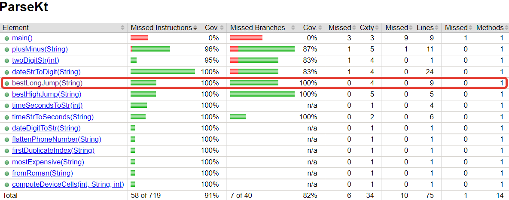

# Тестовое покрытие с помощью "ручных" тестов
## Введение
Тестовое покрытие измерялось с помощью плагина **JaCoCo**.  
Посмотрим на полученные результаты покрытия различных функций из уроков *5-7* тестами "по умолчанию" (классы **Tests**) и новыми тестами (классы **TestNew**).
## lesson 5. Map
Тестировалась функция `averageStockPrice(List)`   
Тестовое покрытие **Tests**:

Теперь проверим покрытие этой функции новыми тестами **TestNew**: 

И сама проверяемая функция:
  
Новые тесты тоже показали *100%* покрытия функции. Это связано с тем, что сама функция не сложная (1 цикл и 1 ветвление), и достаточно легко её проверить.  
При этом все тесты класса **TestNew** успешно проходят.
## lesson 6. Parse
В этом классе проверялась функция `bestLongJump(String)`   
Тестовое покрытие **Tests**:

Те же *100%* покрытия функции. Посмотрим, не ухудшились ли показатели с новыми тестами класса **TestNew**:

Ура, показатели не изменились. Сама функция:
  
Данная функция также не сложная: 1 цикл и 2 ветвления (не считая конструкции `try-catch`).
Для их проверки получилось относительно легко подобрать нужные входные данные.

Однако, 1 тест из класса **TestNew** не проходит: `+706` - это разрешённое число (`706`) или нарушение формата входной строки (`-1`)?
## lesson 7. Files
Здесь протестировали функцию `countSubstrings(String, List)`   
Начальные данные для анализа (класс **Tests**):

Удивительно, но в результате получен только *81%* покрытия. Попробуем улучшить этот показатель (класс **TestNew**):

Результат покрытия стал лучше, но это не *100%*. Посмотрим внимательнее на саму функцию:

Функция состоит из 2-х циклов и 3-х ветвлений. При этом в 2-х ветвлениях не проверяется 1 ветвь (из 4-х).  
Так как этот урок завязан на работе с файлами, то возникли некоторые сложности с генерацией входных данных.
И, возможно, для достижения более высокого тестового покрытия стоит увеличить количество используемых тестов с самыми разнообразными входными данными.
Но также стоит попробовать изменить саму функцию, чтобы проверить эти 2 оставшихся ветвления (например, разделив эти `if` на 2 условия с 2-я ветвлениями).

Стоит отметить, что некоторые (2) тесты из класса **TestNew** не проходят: проверка на неправильное имя входного файла (`FileNotFoundException`) и
пустая строка (`""`) в списке `substrings`. Пусть это и граничные случаи, но они должны проверяться.
## Краткий вывод
Таким образом, для всех *3*-х тестируемых функций удалось достичь с помощью новых тестов достаточно хороших показателей тестового покрытия (*87-100%*).  
Возможно, **fuzzing**-генераторы справятся лучше?!